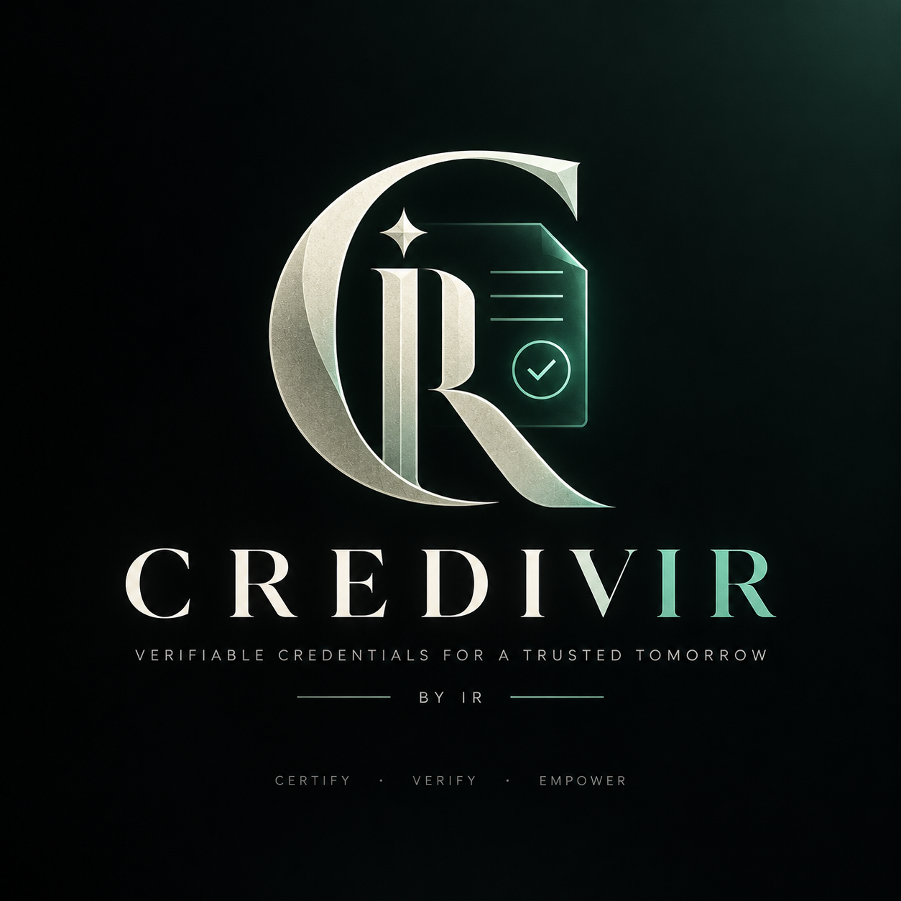

<p align="center">
  
</p>

<p align="center">
  
</p>

<p align="center">
  
</p>

<h2 align="center">🛡️ Enterprise Blockchain Certificate Issuance & Verification Protocol.</h2>

<p align="center">
  
  
  
  
</p>

---
> *"On-Chain Credential Attestation & Instant Tamper-Evident Verification."*  
> **CREDIVIR** is an enterprise-grade cryptographic credential verification platform.  
> Built with **React 18**, **TypeScript**, **Vite**, **Tailwind CSS**, and **Ethers.js** for permanent, tamper-proof academic record sealing on Ethereum smart contracts.

---

# ✨ Features

- 📜 **Cryptographic Certificate Sealing** — Anchors unique Keccak256 diploma hashes directly onto the blockchain.
- 🔍 **Instant Verification Engine** — Drag-and-drop certificate files or input hash string to verify authenticity in real-time.
- 🎓 **Student Portal** — View issued credentials, verified issue timestamps, and download authentic cryptographically sealed badges.
- 👑 **Admin Issuance Portal** — Authorize educational institutions, batch-issue credentials, and manage verification registries.
- ⚡ **Interactive Telemetry** — CountUp statistics, floating proof cards, infinite ticker marquee, and animated verification loader.
- 🌙 **Theme Switcher** — Seamless light and dark mode toggling with persistent user preference storage.
- 🛡️ **Zero-Trust Security** — Prevents diploma forgery, fraudulent claims, and retroactive document tampering.

---

# 💡 Why This Project?

This platform demonstrates:

- **Immutable Data Registry**: Storing digital fingerprint hashes on Ethereum to guarantee lifelong validity.
- **Enterprise UX/UI**: Clean data hierarchy, status badges, toast feedback, and skeleton loaders.
- **TypeScript Architecture**: Strict type checking for web3 contract interfaces, certificate payloads, and state models.

---

# 🧩 Tech Stack

| Layer | Technology |
|-------|-----------|
| Frontend | React 18, Vite 5, TypeScript, Tailwind CSS 3 |
| State & Theme | Lucide React, Next Themes, Framer Motion |
| Web3 Integration | Ethers.js, MetaMask Web3 Provider |
| Design System | Radix UI Primitives, Lucide Icons |

---

# 📂 Project Structure

```plaintext
Certificate Verification/
├── public/
│   └── CREDIVIR_LOGO.png        # Official CREDIVIR Brand Asset
├── src/
│   ├── components/              # Navbar, CredivirLoader, CountUp, Marquee, NavLink, etc.
│   │   ├── admin/               # IssueCertificate, RegisterStudent, ViewAllRecords, Analytics
│   │   └── ui/                  # Radix UI primitives & buttons
│   ├── pages/                   # Index (Overview), Verify, StudentPortal, AdminPortal
│   ├── lib/                     # Utility functions and Web3 helpers
│   ├── App.tsx                  # Root application component
│   └── main.tsx                 # Vite entry point
├── index.html
├── package.json
└── tsconfig.json
```

---

# ⚙️ Installation & Local Setup

### Prerequisites
- Node.js 18+

### 1. Install Dependencies

```bash
# Clone repository
git clone https://github.com/Cipher-Shadow-IR/CREDIVIR-Certificate-Verification.git
cd "Certificate Verification"

# Install node modules
npm install
```

### 2. Run Development Server

```bash
npm run dev
```

Open [http://localhost:5173](http://localhost:5173).

### 3. Production Build

```bash
npm run build
```

---

# 💬 Author

<p align="center">
  <b>Designed & Developed by Ishaan Ray (Cipher Shadow)</b><br>
  <i>"On-Chain Credential Attestation & Instant Verification."</i><br><br>
  <a href="https://github.com/Cipher-Shadow-IR" target="_blank">
    
  </a>
  <a href="https://linkedin.com/in/ishaan-ray-cs" target="_blank">
    
  </a>
  <a href="https://galaxir.vercel.app/" target="_blank">
    
  </a>
</p>

---

# 📜 License

MIT License © Ishaan Ray
